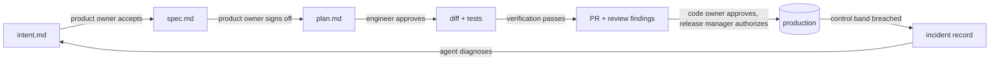

# The artifact chain

Every stage ends by committing one artifact to version control, and the next stage begins by reading it. The artifacts are the handoffs, the triggers, and the audit trail all at once. This page lists each artifact, who writes it, who approves it, and what its acceptance sets in motion.

## The loop



The first pass through this loop is prompted by hand at every step. The end state is a loop where each accepted artifact fires the next stage automatically and a person's first involvement at each stage is the review.

## Where the artifacts live

For a single product the simplest home is a folder in the product repo, next to the code derived from it. Every project seeded from this template has one:

```
intent/
  README.md                       # what goes here, how to name a change
  claims-status-self-service/     # one folder per change, kebab-case slug
    intent.md
    spec.md
    plan.md
```

A dedicated intent repo is only worth the overhead when one intent spans many repositories. In a monorepo it is a directory. If the organization already tracks these in Jira or a requirements tool, see [source-of-truth.md](source-of-truth.md) for how the folder and the tool relate.

From build onward the artifact is code and its records: the diff and its tests in git, the PR with its review findings on the hosting platform, the incident record in the tracker or in the `intent/` folder as a new intent.

## The artifacts

### intent.md

| | |
|---|---|
| **What it is** | A proto-spec in the originator's own words: the problem, the proposed outcome, affected users and systems, constraints, open questions. |
| **Who writes it** | The originator (anyone in the organization) brainstorming with Claude. Or an agent, when the loop closes from a production breach, a scan finding, or a tagged ticket. |
| **Who approves it** | The product owner reviews and corrects it, then accepts or closes it. |
| **What commits it** | The originator via a git connector from claude.ai or Cowork, or an engineer via `/ai-native-sdlc:intent`. Merge of the PR into `intent/<slug>/` is the acceptance. |
| **What it fires** | An accepted intent triggers the requirements and design pass. |
| **Format** | The `intent` skill in the plugin. |

### spec.md

| | |
|---|---|
| **What it is** | A requirements and design spec the engineering team can plan against, with flagged areas of concern where policies conflict. |
| **Who writes it** | Claude, from the accepted intent, constrained by the organization's skills for brand, security, compliance, and UX. |
| **Who approves it** | The product owner reviews it against the idea, resolves each flagged concern with its policy owner, and signs it off. A technical lead is consulted for anything classed as higher risk. |
| **What commits it** | By hand at first via `/ai-native-sdlc:spec`, later the `spec-on-intent-merge.yml` workflow commits it as a PR when an intent merges. |
| **What it fires** | An accepted spec starts plan mode in build. |
| **Format** | The `spec` skill. |

### plan.md

| | |
|---|---|
| **What it is** | An implementation plan naming the files that change, the order of work, the risks, and the tests that prove it. Written so an engineer who never saw the conversation could implement it. |
| **Who writes it** | Claude in plan mode, interviewed and corrected by the engineer. |
| **Who approves it** | The engineer for routine changes; a tech lead or architect for anything classed as higher risk. |
| **What commits it** | The engineer, via `/ai-native-sdlc:plan`, before any code is written. If implementation departs from the plan, the plan is updated in the same commit. |
| **What it fires** | Accepting the plan lets Claude implement. |
| **Format** | The `plan` skill. |

### The diff and its tests

| | |
|---|---|
| **What it is** | The code change and the tests that prove it, produced in one or a few passes from the plan. |
| **Who writes it** | Claude, with the engineer steering. |
| **Who approves it** | Nobody yet. The session verifies its own work first: build, tests, lint, screenshot. Only output that has passed the check reaches a person. |
| **What commits it** | The engineer, or the session under the engineer's identity. Branch protection means it can only arrive on `main` through a PR. |
| **What it fires** | Opening the PR triggers the review passes. |

### The PR and its review findings

| | |
|---|---|
| **What it is** | The pull request, the ranked findings from the agentic review passes defined in `REVIEW.md`, the fixes pushed in response, and the human approval. |
| **Who writes it** | Claude reviews against `REVIEW.md`; Claude addresses comments when tagged; `/ai-native-sdlc:babysit-pr` sweeps unresolved comments and failing checks until the PR is green. |
| **Who approves it** | A code owner, through branch protection. Findings never approve or block on their own. The agent that wrote the code has no route to approve it. |
| **What commits it** | The merge. |
| **What it fires** | A merged PR triggers the pipeline. The production gate hook blocks the deploy until a named release manager authorizes it. |

### The incident record

| | |
|---|---|
| **What it is** | A breached control band, a scan finding, or a tagged incident: the anomaly, its evidence, a proposed outcome, affected systems, open questions. |
| **Who writes it** | Claude, invoked by a deterministic detection script (`ops/bands.yaml`), a scheduled scan, or a message in an incident channel. |
| **Who approves it** | The service owner or on-call engineer triages: fix now, schedule, or dismiss. Product-facing findings route to the product owner. |
| **What commits it** | The agent, as a new `intent.md` in the Stage 1 format, or as a PR into the review gate for a fix that fits in one change. |
| **What it fires** | The loop restarts at plan. When the fix ships, an eval is added so the regression is caught in CI from then on. |

## What the chain buys you

- **Traceability.** Every artifact carries author, timestamp, and revision history in git. Auditors can read who asked for what, what the agent produced, and who approved it, without a separate system.
- **Attention at the gates.** People review what the agent flagged instead of starting each stage from a blank page.
- **Automation without losing control.** Because each stage reads a committed file and writes a committed file, the trigger between stages can be a CI job. The human gates stay exactly where they are.
- **Compliance checks against intent.** The PR review compares the diff to `spec.md` and `plan.md`, so drift from what was asked for is a review finding rather than a surprise.
