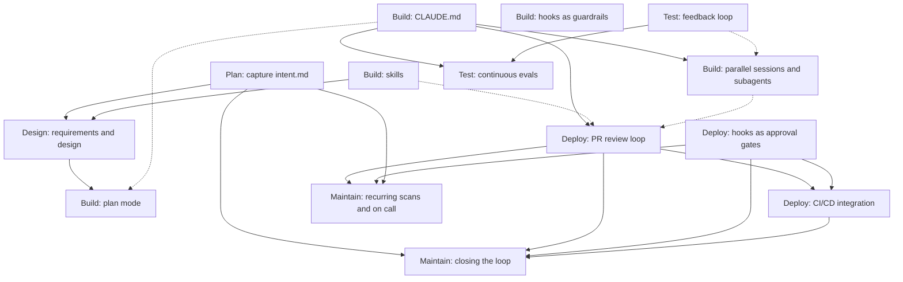

# Adoption order

The plays are modular. Each one names its prerequisites, and together those form a dependency graph. The graph gives the order to adopt plays in, which is not the same as the order of the six stages. Any play with nothing pointing into it can be adopted today.

## The dependency graph

Solid arrows are hard prerequisites. Dotted arrows mean "helps" in the article's words: adopt it first if you can, but the play works without it.

### Plays that need nothing first

Six plays have no prerequisites. Start with any of them, in any order:

| Play | Why start here |
|---|---|
| [Capture intent.md](plays/plan-intent.md) | Gives the loop its input. Needs only an `intent/` folder and a template. |
| [CLAUDE.md](plays/build-claude-md.md) | Every other Claude Code play reads it. Half a day of one engineer's time. |
| [Skills](plays/build-skills.md) | One inconsistently enforced policy, written down once. |
| [Hooks as guardrails](plays/build-hooks-guardrails.md) | Protected paths and formatter-on-save, no policy decisions needed. |
| [Feedback loop](plays/test-feedback-loop.md) | One command that runs the tests and exits non-zero. Pays off in every session. |
| [Hooks as approval gates](plays/deploy-approval-gates.md) | Needs only a written list of the approvals that must survive. |

For a new project the plugin and template give you all six on day one. The rest are adopted as the team's review capacity allows.

### The recommended order for an existing repo

1. CLAUDE.md, the feedback loop, and guardrail hooks. These are engineer-only, invisible to the rest of the organization, and make every session better immediately.
2. Plan mode as the default starting point. A habit, not infrastructure.
3. The `intent/` folder and the intent format. This is the first play that involves the product owner.
4. One or two policy skills. Pick the policy that generates the most review comments today.
5. The requirements and design pass, by hand, then as a slash command.
6. PR review with `REVIEW.md`, and the approval gates that must hold.
7. Continuous evals, once there are twenty to fifty real tasks to draw on.
8. CI/CD integration, parallel sessions, then closing the loop.

`../brownfield/README.md` turns this into a runbook with the concrete files at each step.

## The maturity ladder

Each play, and the loop as a whole, moves through the same four levels. Do not skip levels: the manual version is how you discover what the prompt needs to say, and the slash command is how you find out whether it is stable enough to automate.

| Level | What it looks like | Where human attention goes |
|---|---|---|
| **1. By hand** | A person opens a session, attaches the previous artifact, and prompts the next step. | Steering the session. |
| **2. Slash command** | The prompt is codified as a command in the plugin (`/ai-native-sdlc:spec`, `/ai-native-sdlc:plan`). Anyone on the team gets the same result. | Reviewing the output. |
| **3. CI-triggered** | The acceptance of one artifact fires a non-interactive job that produces the next one and opens a PR (`spec-on-intent-merge.yml`). | Reviewing the PR. The person's first involvement is the review. |
| **4. Headless loop** | A deterministic trigger (a control band breach, a scheduled scan, a tagged ticket) invokes Claude with no person in the invocation path. Independent confidence gates between stages decide whether the output continues or escalates. | Triaging the queue. |

Level 4 is only safe once the guardrails from the earlier plays are in place: a tuned CLAUDE.md, skills that encode policy, hooks that block unsafe actions, a test suite the agent can run, a review gate, and a rehearsed rollback. The article is explicit that the gates must exist before automation accelerates anything through them.

## Greenfield versus brownfield

**Greenfield** means the whole graph is installed at once. `scripts/new-project.sh` copies `plugin/template/` into the new repo and installs the plugin. Every play is present as a file from the first commit; the team's job is to fill in `CLAUDE.md` as the codebase takes shape and to climb the maturity ladder play by play.

**Brownfield** means walking the graph in dependency order on a repo that already has code, conventions, a CI pipeline, and probably a Jira project. The plugin installs in one step. The template files are added one play at a time, each one a small PR the team reviews like any other. The `/ai-native-sdlc:adopt` command does the mechanical work of each step; `../brownfield/README.md` is the human runbook that says what to decide before running it.

The end state is identical. A brownfield repo six months in should be indistinguishable from a greenfield one.

## What the fully automated ladder looks like in practice

All four CI-triggered plays were exercised on a sandbox repository on 2026-09-03, each with a real trigger:

| Trigger | Workflow | What happened |
|---|---|---|
| An accepted `intent.md` pushed to main | `spec-on-intent-merge.yml` | A spec PR opened under the token's identity, with the policy skill applied and nine concerns for the product owner |
| A PR opened with a new route and no test | `claude-review.yml` | One comment-only review: seven findings, including three the author had not planted |
| `@claude` comment from the repo owner | `claude-mention.yml` | The babysit skill pushed fixes and replied in each thread; CI re-ran on the push |
| A PR that breaks the build | `triage-failed-build.yml` | A triage comment naming the failing line and its commit |

Two prerequisites decided whether the chain connected. A PR or push made with the default Actions token triggers nothing else, so without a fine-grained token in `LOOP_GH_TOKEN` a bot-opened spec PR gets no CI and no review. And the repository setting that lets Actions create pull requests must be on. Both are in the workflow headers.

When the sandbox work is done, disable the workflows that call Claude rather than deleting them: `gh workflow disable <name>` per workflow, and `gh workflow enable` to bring one back. The plain CI check stays on.
